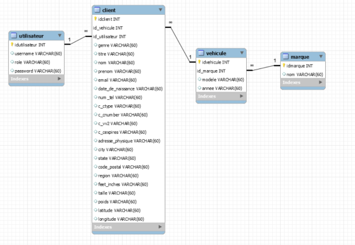

# Vetux-Line 
## Projet 
### Information 
Vetux-Line est un projet scolaire (BTS SIO 2ème année).  
[Énoncé de la Mission](https://ocapuozzo.github.io/mission-etl-csv/)  
Afin de réaliser cette application Web nous avons utilisé Symfony 5 (Framework PHP).  
IDE : PhpStorm  
Version de PHP : 7.4.21  
Version de composer : 2.1.8

### Installation du projet 
#### Récupérer le projet 
    git clone https://github.com/axelelise/Vetux-Line.git
#### Récupérer toutes les librairies du projet 
    composer update
#### Création de la BDD
* Dans une application de gestion de base de donnée type PhpMyAdmin, créer une base de donnée vide nommée Vetux-Line et créer un utilisateur qui n'a accès qu'à celle-ci.  
* Adapter les informations du .env afin qu'il vous corresponde.  
* Supprimer toutes les anciennes migrations dans le dossier du même nom.  
* Puis créer vos tables complète à l'aide des 2 commandes suivantes.  
#####   
```bash
    php bin/console make:migration
    php bin/console doctrine:migrations:migrate 
```
### Contexte 

La société VETUX-LINE reçoit de la part de ses partenaires, tous les mois, 2 fichiers clients au format CSV.   

### Présentation de la Mission
1. **Fusion++**  
Dans la première partie il nous ai demandé de créer une application pour permettre à Vetux-Line de pouvoir fusionner les 2 fichiers de ses partenaire en 1, tout en respectant certain critère  
   ####
   * **Critère de Suppression:**
      * Les colonnes ne sont pas toute utile 
      * Lorsque le taille en inch ne correspond pas a celle en cm, il nous ai demandé de supprimer le client afin d'éviter les erreurs 
      * Lorsque le client n'est pas majeur nous devons le supprimer de la liste
      * Nous devons également extraire les clients qui ne sont pas identifiable par leurs numéro de CB (doublons) 
   ####
   * **Critère de Trie**
     * L'application doit offrir la possibilité à l'utilisateur de pouvoir trier sa fusion sous forme **Séquentiel** ou **Entrelacé**.
       ####
        
   ####  

2. **ETL (Extract Transform Load)**  
Dans la seconde partie, il nous ai demandé d'obtenir ces données sous la forme d’une base de données relationnelle.

## Mission 1 :

###Gestion des droits 
* Seul l'administrateur a le droit d'inscrire de nouveau utilisateur.
* Seul les personnes connecter ont le droit de consulter les pages de l'application. 
### Upload 
Afin de pouvoir répondre au besoin de l'utilisateur nous avons créé uploader. 
####


#### Comment fonctionne l'upload 
Il suffit à l'utilisateur de cliquer sur les boutons Browse et de sélectionner les fichiers CSV qu'il souhaite importer.  

#### Explication du code

```php
    public function upload(Request $request,
    FileUploader $uploader, LoggerInterface $logger): Response
    {
        // Ont récupère les fichiers
        $file = $request->files->get('myfile');
        $file2 = $request->files->get('myfile2');

        // Si aucun fichier a été importer nous envoyons un message d'erreur
        if (empty($file) || empty($file2))
        {
            return new Response("No file specified",
               Response::HTTP_UNPROCESSABLE_ENTITY, ['content-type' => 'text/plain']);
        }

        // Ont récupere le nom de nos fichiers
        $filename = $file->getClientOriginalName();
        $filename2 = $file2->getClientOriginalName();

        // Ont les importes dans le dossier Fichiers_CSV
        $uploader->upload('../src/Fichiers_CSV/', $file, $filename);
        $uploader->upload('../src/Fichiers_CSV/', $file2, $filename2);

        // Ont place le nom des fichiers dans la session afin de pouvoir les réutiliser par la suite
        $session = $this->requestStack->getSession();
        $session->set('fichier1', '../src/Fichiers_CSV/'.$filename);
        $session->set('fichier2', '../src/Fichiers_CSV/'.$filename2);

        return $this->redirectToRoute('choix');
    }
```

### Le Choix du Mélange 
Une fois que l'utilisateur a importé ses fichiers correctement, celui-ci est redirigé sur cette page.  
Ici comme demander dans le cahier des charges l'utilisateur peut choisir son type de mélange, **Entrelacé** ou **Séquentiel**.
####


#### Explication du code

```php
    public function choix(Request $request): Response
    {
         // On permet l'acces qu'au personne inscrit sur l'application
         $this->denyAccessUnlessGranted('ROLE_USER');

          // Ont crée un formulaire grâce à symfony form
          $form = $this->createForm(FormMelangeType::class);

          // Ont gere le traitement de la saisie du formulaire
          $form->handleRequest($request);

          // Code a executer si les données du formulaire ont était envoyer
          if($form->isSubmitted()){

              // Ont recupere le choix du user
              $choix = $form["type"]->getData();

              // On deplace l'utilisateur dans la route fusion en lui indiquant le choix du tri
              return $this->redirectToRoute('fusion',['choixMelange' => $choix,]);
          }

          return $this->render('Fusion/formulaire_choix.html.twig', [
              'form' => $form->createView()
          ]);
    }
```
### Fusion
Maintenant que nous disposons des fichiers CSV importer par l'utilisateur, ainsi que du type de tri qu'il souhaite utiliser, nous allons pouvoir passer à la fusion.  
Cette tâche s'exécute en arrière plan, l'utilisateur n'a donc pas d'affichage pour voir la fusion s'exécuter 

#### Explication du code 
```php 
    // src/Controller/FusionController.php

    public function fusion(Convertisseur $convertisseur, $choixMelange, Fusion $fusion)
    {
        // Ont autorise l'acces qu'au utilisateur (Toutes les personnes inscrite par l'admin)
        $this->denyAccessUnlessGranted('ROLE_USER');

        // Lancement de la session
        $session = $this->requestStack->getSession();

        // Recuperation des noms de fichier stocker dans la session lors de upload
        $file1 = $session->get('fichier1');
        $file2 = $session->get('fichier2');

        // La fonction fusion supprime les colonnes inutiles, fait un trie
        // et renvoi un tableau associatif contenant les 2 fichiers mélangé
        $tableauMelangerEtTrier = $fusion->fusion($file1, $file2, $choixMelange);

        // Ont replace le contenu de notre tableau associatif dans un autre tableau pour eviter les
        // clées vide a cause du trie ( [0]=> , [1]=> ["pays"] => "France")
        foreach ($tableauMelangerEtTrier as $tab){
            $tableauFini [] = $tab;
        }

        // Initalise un fichier Csv depuis notre tableau associatif
        Convertisseur::arrayToCsv($tableauFini, '../src/Fichiers_CSV/french_german_client.csv');


        return $this->render('Fusion/download.html.twig');
    }
```
Ce code utilise la fonction fusion. Celle-ci est très importante c'est pourquoi nous allons aussi expliquer son fonctionnement.  

```php
    // src/Service/Fusion.php
    
    public static function fusion($file1, $file2, $typeMelange){

        // Convertie le fichier en tableau associatif
        $tab = Convertisseur::csvToArray($file1);

        // Supprime les colonnes inutiles
        $tab = self::selection($tab);

        // Trie les données selon les critères de suppression 
        $tab = self::trie($tab);

        // Ont replace le contenu de notre tableau associatif dans un autre tableau pour éviter les
        // clées vide a cause du trie ( [0]=> , [1]=> ["pays"] => "France")
        foreach ($tab as $tab){
            $tab1 [] = $tab;
        }

        $tab = Convertisseur::csvToArray($file2);
        $tab = self::selection($tab);
        $tab = self::trie($tab);

        foreach ($tab as $tab){
            $tab2 [] = $tab;
        }

        // Melange les valeurs des tableaux selon le choix de l'utilisateur
        if($typeMelange === "Entrelacé"){

            $logueurMax = 0;
            if(count($tab1)>count($tab2)){
                $logueurMax = count($tab1);
            }
            else{
                $logueurMax = count($tab2);
            }

            for($i=0; $i<$logueurMax; $i++){
                if($i < count($tab1)){
                    $tab3[] = $tab1[$i]; 
                }
                if($i < count($tab2)){
                    $tab3[] = $tab2[$i]; 
                }
            }

            return $tab3;

        }

        elseif($typeMelange === "Séquentiel"){
            for($i=0;$i<count($tab1);$i++){
                $tab3[] = $tab1[$i];
            }
            for($i=0;$i<count($tab2);$i++){
                $tab3[] = $tab2[$i];
            }
        
            return $tab3;

        }
    }
```

Cette fonction depend elle meme de 2 autres fonctions importantes du projet
 * La fonction **selection** qui vas sélectionner seulement les colonnes du fichier csv qui nous intéresse.  
 * La fonction **trie** qui vas supprimer toutes les lignes qui ne correspondent pas au critère de l'utilisateur.  

#### Fonction Selection :
```php
    // src/Service/Fusion.php

    public function selection ($tab3){

        // compte la longueur du tableau placer en parametre
        $longueurTab3 = count($tab3);

        // On initialise un tableau contenant les champs qu'on souhaite utiliser
        $colonneUtiliser = ["Gender","Title","GivenName","Surname","EmailAddress","Birthday","TelephoneNumber","CCType","CCNumber","CVV2","CCExpires","StreetAddress","City","StateFull","ZipCode","CountryFull","FeetInches","Centimeters","Pounds","Vehicle","Latitude","Longitude"];

        // Boucle qui parcours le tableau
        for($i=0; $i<$longueurTab3;$i++){

            foreach($tab3[$i] as $key => $value){

                // si la clée du tableau associtif n'est pas dans le tableau des colonne a utiliser
                // alors on la supprime
                if(in_array($key,$colonneUtiliser)){

                }
                else{
                    unset($tab3[$i][$key]);
                }
            }
        }

        return $tab3;
    }
```
#### Fonction Trie :
```php
    // src/Service/Fusion.php

    public function trie($tab3){

        $longueurTab3 = count($tab3);
        $cbUtiliser = [];

        for($i=0; $i<$longueurTab3;$i++){

            // Ont converti la date d'anniversaire en age
            $age = Convertisseur::age($tab3[$i]["Birthday"]);

            // Si il est mineur ont le supprime de la liste
            if($age < 18){
                unset($tab3[$i]);
            }

            // Si il n'a pas été retirer de la liste mais que sa taille en inch ne correspond pas a celle en cm
            // ont le supprime également de la liste
            elseif($tab3[$i]["FeetInches"]!= Convertisseur::cmToFeet($tab3[$i]["Centimeters"])){
                unset($tab3[$i]);
            }

            // Si il n'a pas été retirer de la liste mais que le numero de sa CB est dans le tableau des CCB alors
            // ont le supprime également de la liste
            elseif(in_array($tab3[$i]["CCNumber"], $cbUtiliser)){
                unset($tab3[$i]);
            }

            // Si le numéro de CB n'existe pas dans le tableau alors on le rajoute afin d'eviter les doublons
            else{
                $cbUtiliser [] = $tab3[$i]["CCNumber"];
            }
        }  
        
        return $tab3;

    }
```

### Le Téléchargement 
Lorsque l'utilisateur a fait le choix de son type de fusion (Séquentiel ou Entrelacé), il sera redirigé sur la page Download. 
Cette page est simple, il suffit à l'utilisateur de télécharger son fichier fusionner. 


#### Explication du code 
    
Le lien renvoi vers ce controlleur.
```php
        // src/Controller/Fusion.php

        public function downloadFileAction(){

        // Recupere le fichier a télécharger 
        $response = new BinaryFileResponse('../src/Fichiers_CSV/french_german_client.csv');
        
        // Renvoi a l'utilisateur la possibilité de télécharger un fichier french-germain_[date].csv
        $response->setContentDisposition(ResponseHeaderBag::DISPOSITION_ATTACHMENT,'french-german-client_'.date('d-m-Y').'.csv');
        
        return $response;
    }
```

### Test Unitaire

```php
    public function testMelangeEntrelace(){

        $file1 = "./src/miniFrGer/small-french-client.csv";
        $file2 = "./src/miniFrGer/small-german-client.csv";
        $typeMelange = "Entrelacé";
        
        $tab = Fusion::fusion($file1,$file2,$typeMelange);

        $this->assertEquals("France",$tab[0]["CountryFull"]);
        $this->assertEquals("Germany",$tab[1]["CountryFull"]);
    }

    public function testMelangeSequentiel(){

        $file1 = "./src/miniFrGer/small-french-client.csv";
        $file2 = "./src/miniFrGer/small-german-client.csv";
        $typeMelange = "Séquentiel";
        
        $tab = Fusion::fusion($file1,$file2,$typeMelange);

        $this->assertEquals("France",$tab[0]["CountryFull"]);
        $this->assertEquals("France",$tab[1]["CountryFull"]);
    }
```
Ici nous avons testé si notre fonction fusion fusionne correctement nos fichiers.   
Dans le premier test nous testons si fusion avec le mélange Entrelacé nous renvoi bien ["France" ; "Germany" ; "France" ; "Germany"] (1 sur 2).    
Dans le second test nous testons si fusion avec le mélange Séquentiel nous renvoi bien ["France" ; "France" ; "Germany" ; "Germany"] (Tous les France d'abord puis les Germany).

### Problème rencontrer : 
 * La conversion Cm => FeetInch :  
 A cause du format des FeetInch dans le tableau Csv (5' 4").  
 Pour résoudre le problème des guillemets dans une chaine de caractère, nous avons dans un premier temps mis les codes HTML de la guillemet simple puis celle de la guillemet double mais ceci n'a pas fonctionné car en effet la taille en cm convertie en feetInch correspondais a celle en feetInch mais pas au niveau des bytes, alors lors de l'exécusion il n'était pas concidéré comme égaux.

### Solution 
Nous avons utilisé la concaténation en php 
```php
    feetInch = "5' ".'4"';
```
### Amélioration possible :
 * Obliger l'utilisateur de sélectionner des fichiers csv afin d'éviter les erreurs.
 * Gestionnaire disponible pour l'utilisateur avec tous les fichiers fusions qu'il a créé.


## Mission 2 
### Schéma relationnel de la BDD 

### Fonction ETL 
```php
    public static function etl ($tab){

        $entityManager = $this->getDoctrine()->getManager();

        for($i=0; $i<count($tab); $i++){

            $client = new Client();
            $client->setGenre($tab[$i]["Gender"]);
            $client->setTitre($tab[$i]["Title"]);
            $client->setNom($tab[$i]["GivenName"]);
            $client->setPrenom($tab[$i]["Surname"]);
            $client->setEmail($tab[$i]["EmailAddress"]);
            $client->setDateDeNaissance($tab[$i]["Birthday"]);
            $client->setNumTel($tab[$i]["TelephoneNumber"]);
            $client->setCCType($tab[$i]["CCType"]);
            $client->setCCNumber($tab[$i]["CCNumber"]);
            $client->setCCExpires($tab[$i]["CCExpires"]);
            $client->setCVV2 ($tab[$i]["CVV2"]);
            $client->setAdressePhysique($tab[$i]["StreetAddress"]);
            $client->setCity($tab[$i]["City"]);
            $client->setState($tab[$i]["State"]);
            $client->setCodePostal($tab[$i]["ZipCode"]);
            $client->setRegion($tab[$i]["CountryFull"]);
            $client->setFeetInch($tab[$i]["FeetInches"]);
            $client->setTaille($tab[$i]["Centimeters"]);
            $client->setPoids($tab[$i]["Pounds"]);
            $client->setLatitude($tab[$i]["Latitude"]);
            $client->setLongitude($tab[$i]["Longitude"]);
            $entityManager->persist($client);
            $entityManager->flush();
            
            $infoVehicules = explode(' ',$tab[$i]["Vehicle"]);
            $annee = $infoVehicules[0];
            $marque = $infoVehicules[1];
            $modele = $infoVehicules[2];
            
            $vehicule = new Vehicule();
            $vehicule->setModele($modele);
            $vehicule->setAnnee($annee);
            $entityManager->persist($vehicule);
            $entityManager->flush();
            
            $marque = new Marque();
            $marque->setNom($marque);
            $entityManager->persist($marque);
            $entityManager->flush();

        }
    }
```

### Explication de cette fonction 
Cette fonction va récupérer les informations contenu dans le tableau associatif créé avec le contenu des 2 fichiers CSV.
