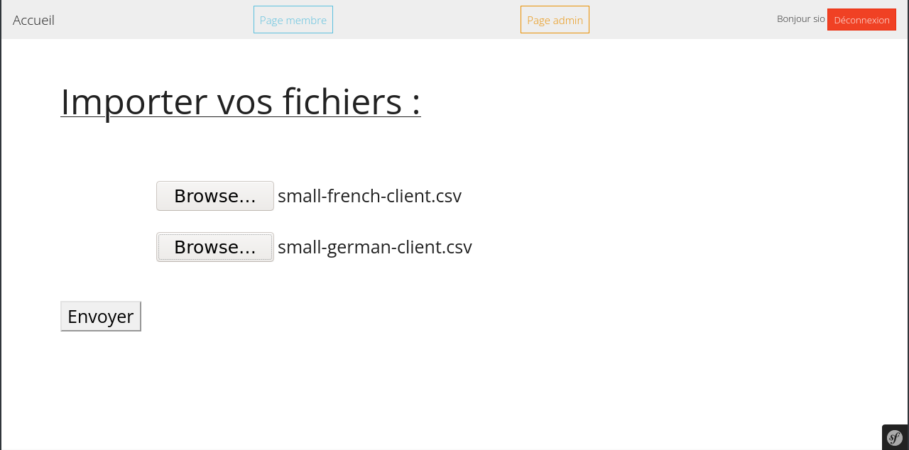
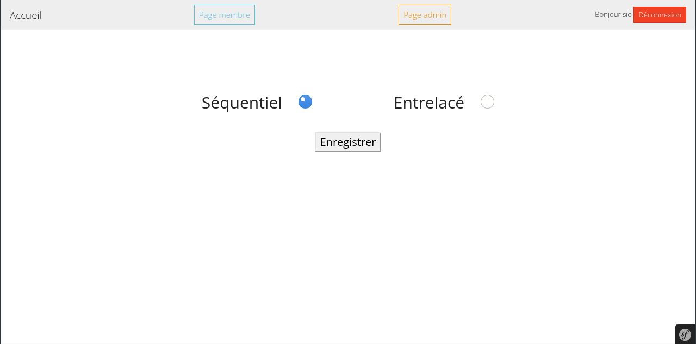
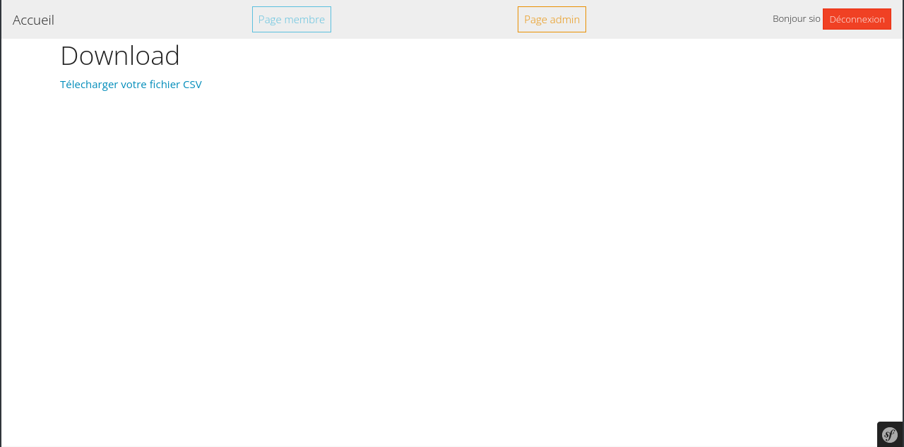

# Vetux-Line 
## Projet 
### Information 
Vetux-Line est un projet scolaire (BTS SIO 2ème année).  
Afin de réaliser cette application Web nous avons utiliser Symfony 5 (Framework PHP).  
IDE : PhpStrom  
Version de PHP : 7.4.21  
Version de composer : 2.1.8

### Installation du projet 
#### Récuperer le projet 
    git clone https://github.com/axelelise/Vetux-Line.git
#### Récuperer toute les librairies du projet 
    composer update
#### Création de la BDD
* Dans une application de gestion de base de donnée type PhpMyAdmin, créer une base de donnée vide nommée Vetux-Line et créer un utilisateur qui n'a acces qu'a cele ci.  
* Adapter les informations du .env afin qu'il vous corresponde.  
* Supprimer toute les anciennes migrations dans le dossier du même nom.  
* Puis créer vos table complete a l'aide des 2 commandes suivante.  
#####         
    php bin/console make:migration
    php bin/console doctrine:migrations:migrate 

### Contexte 

La société VETUX-LINE reçoit de la part de ses partenaires, tous les mois, 2 fichiers clients au format CSV.   

### Présentation de la Mission
1. **Fusion++**  
Dans la première partie il nous ai demander de créer une application pour permettre a Vetux-Line de pouvoir fusionner les 2 fichiers de ses partenaire en 1, tous en respectant certain critère  
   ####
   * **Critère de Suppression:**
      * Les colonnes ne sont pas toute utile 
      * Lorsque le taille en inch ne correspond pas a celle en cm, il nous ai demander de supprimer le client afin d'eviter les erreurs 
      * Lorsque le client n'est pas majeur nous devont le supprimer de la liste
      * Nous devons également extraire les clients qui ne sont pas identifiable par leurs numéro de CB (doublons) 
   ####
   * **Critère de Trie**
     * L'application dois offrir la possibilté a l'utilisateur de pouvoir trier sa fusion sous forme **Séquentiel** ou **Entrelacé**.
       ####
        
   ####  

2. **ETL (Extract Transform Load)**  
Dans la seconde partie, il nous ai demander d'obtenir ces données sous la forme d’une base de données relationnelle.

## Mission 1 :  

### Upload 
Afin de pouvoir repondre au besoin de l'utilisateur nous avons créer uploader. 
####

#### Comment fonctionne l'upload 
Il suffit à l'utilisateur de cliquer sur les boutons Browse et de sélectionner les fichiers CSV qu'il souhaite importer.  

#### Explication du code
    public function upload(Request $request,
    FileUploader $uploader, LoggerInterface $logger): Response
    {
        // Ont récupère les fichiers
        $file = $request->files->get('myfile');
        $file2 = $request->files->get('myfile2');

        // Si aucun fichier a été importer nous envoyons un message d'erreur
        if (empty($file) || empty($file2))
        {
            return new Response("No file specified",
               Response::HTTP_UNPROCESSABLE_ENTITY, ['content-type' => 'text/plain']);
        }

        // Ont récupere le nom de nos fichiers
        $filename = $file->getClientOriginalName();
        $filename2 = $file2->getClientOriginalName();

        // Ont les importes dans le dossier Fichiers_CSV
        $uploader->upload('../src/Fichiers_CSV/', $file, $filename);
        $uploader->upload('../src/Fichiers_CSV/', $file2, $filename2);

        // Ont place le nom des fichiers dans la session afin de pouvoir les réutiliser par la suite
        $session = $this->requestStack->getSession();
        $session->set('fichier1', '../src/Fichiers_CSV/'.$filename);
        $session->set('fichier2', '../src/Fichiers_CSV/'.$filename2);

        return $this->redirectToRoute('choix');
    }

### Le Choix du Mélange 
Une fois que l'utilisateur a importer ses fichiers correctement, celui ci est rediriger sur cette page.  
Ici comme demander dans le cahier des charges l'utilisateur peut choisir sont type de mélange, **Entrelacé** ou **Séquentiel**.
####

#### Explication du code

    public function choix(Request $request): Response
    {
         // On permet l'acces qu'au personne inscrit sur l'application
         $this->denyAccessUnlessGranted('ROLE_USER');

          // Ont crée un formulaire grâce à symfony form
          $form = $this->createForm(FormMelangeType::class);

          // Ont gere le traitement de la saisie du formulaire
          $form->handleRequest($request);

          // Code a executer si les données du formulaire ont était envoyer
          if($form->isSubmitted()){

              // Ont recupere le choix du user
              $choix = $form["type"]->getData();

              // On deplace l'utilisateur dans la route fusion en lui indiquant le choix du tri
              return $this->redirectToRoute('fusion',['choixMelange' => $choix,]);
          }

          return $this->render('Fusion/formulaire_choix.html.twig', [
              'form' => $form->createView()
          ]);
    }`

### Fusion
Maintenant que nous disposons des fichiers CSV importer par l'utilisateur, ainsi que du type de tri qu'il souhaite utiliser, nous allons pouvoir passer à la fusion.  
Cette tâche s'execute en arrière plan, l'utilisateur n'a donc pas d'affichage pour voir la fusion s'executer 

#### Explication du code 
    
    // src/Controller/FusionController.php

    public function fusion(Convertisseur $convertisseur, $choixMelange, Fusion $fusion)
    {
        // Ont autorise l'acces qu'au utilisateur (Toutes les personnes inscrite par l'admin)
        $this->denyAccessUnlessGranted('ROLE_USER');

        // Lancement de la session
        $session = $this->requestStack->getSession();

        // Recuperation des noms de fichier stocker dans la session lors de upload
        $file1 = $session->get('fichier1');
        $file2 = $session->get('fichier2');

        // La fonction fusion supprime les colonnes inutiles, fait un trie
        // et renvoi un tableau associatif contenant les 2 fichiers mélangé
        $tableauMelangerEtTrier = $fusion->fusion($file1, $file2, $choixMelange);

        // Ont replace le contenu de notre tableau associatif dans un autre tableau pour eviter les
        // clées vide a cause du trie ( [0]=> , [1]=> ["pays"] => "France")
        foreach ($tableauMelangerEtTrier as $tab){
            $tableauFini [] = $tab;
        }

        // Initalise un fichier Csv depuis notre tableau associatif
        Convertisseur::arrayToCsv($tableauFini, '../src/Fichiers_CSV/french_german_client.csv');

        return $this->render('Fusion/download.html.twig');
    }

Ce code utilise la fonction fusion. Celle ci est très importante c'est pourquoi nous allons aussi expliquer sont fonctionnement.  

    // src/Service/Fusion.php
    
    public static function fusion($file1, $file2, $typeMelange){

        // Convertie le fichier en tableau associatif
        $tab = Convertisseur::csvToArray($file1);

        // Supprime les colonnes inutiles
        $tab = self::selection($tab);

        // Trie les données selon les critères de suppression 
        $tab = self::trie($tab);

        // Ont replace le contenu de notre tableau associatif dans un autre tableau pour éviter les
        // clées vide a cause du trie ( [0]=> , [1]=> ["pays"] => "France")
        foreach ($tab as $tab){
            $tab1 [] = $tab;
        }

        $tab = Convertisseur::csvToArray($file2);
        $tab = self::selection($tab);
        $tab = self::trie($tab);

        foreach ($tab as $tab){
            $tab2 [] = $tab;
        }

        // Melange les valeurs des tableaux selon le choix de l'utilisateur
        if($typeMelange === "Entrelacé"){

            $logueurMax = 0;
            if(count($tab1)>count($tab2)){
                $logueurMax = count($tab1);
            }
            else{
                $logueurMax = count($tab2);
            }

            for($i=0; $i<$logueurMax; $i++){
                if($i < count($tab1)){
                    $tab3[] = $tab1[$i]; 
                }
                if($i < count($tab2)){
                    $tab3[] = $tab2[$i]; 
                }
            }

            return $tab3;

        }

        elseif($typeMelange === "Séquentiel"){
            for($i=0;$i<count($tab1);$i++){
                $tab3[] = $tab1[$i];
            }
            for($i=0;$i<count($tab2);$i++){
                $tab3[] = $tab2[$i];
            }
        
            return $tab3;

        }
    }

Cette fonction depend elle meme de 2 autres fonctions importante du projet
 * La fonction **selection** qui vas sélectioner seulement les colonnes du fichier csv qui nous intéresse.  
 * La fonction **trie** qui vas supprimer toute les lignes qui ne correspond pas au critère de l'utilisateur.  

#### Fonction Selection :

    // src/Service/Fusion.php

    public function selection ($tab3){

        // compte la longueur du tableau placer en parametre
        $longueurTab3 = count($tab3);

        // On initialise un tableau contenant les champs qu'on souhaite utiliser
        $colonneUtiliser = ["Gender","Title","GivenName","Surname","EmailAddress","Birthday","TelephoneNumber","CCType","CCNumber","CVV2","CCExpires","StreetAddress","City","StateFull","ZipCode","CountryFull","FeetInches","Centimeters","Pounds","Vehicle","Latitude","Longitude"];

        // Boucle qui parcours le tableau
        for($i=0; $i<$longueurTab3;$i++){

            foreach($tab3[$i] as $key => $value){

                // si la clée du tableau associtif n'est pas dans le tableau des colonne a utiliser
                // alors on la supprime
                if(in_array($key,$colonneUtiliser)){

                }
                else{
                    unset($tab3[$i][$key]);
                }
            }
        }

        return $tab3;
    }

#### Fonction Trie :

    // src/Service/Fusion.php

    public function trie($tab3){

        $longueurTab3 = count($tab3);
        $cbUtiliser = [];

        for($i=0; $i<$longueurTab3;$i++){

            // Ont converti la date d'anniversaire en age
            $age = Convertisseur::age($tab3[$i]["Birthday"]);

            // Si il est mineur ont le supprime de la liste
            if($age < 18){
                unset($tab3[$i]);
            }

            // Si il n'a pas été retirer de la liste mais que sa taille en inch ne correspond pas a celle en cm
            // ont le supprime également de la liste
            elseif($tab3[$i]["FeetInches"]!= Convertisseur::cmToFeet($tab3[$i]["Centimeters"])){
                unset($tab3[$i]);
            }

            // Si il n'a pas été retirer de la liste mais que le numero de sa CB est dans le tableau des CCB alors
            // ont le supprime également de la liste
            elseif(in_array($tab3[$i]["CCNumber"], $cbUtiliser)){
                unset($tab3[$i]);
            }

            // Si le numéro de CB n'existe pas dans le tableau alors on le rajoute afin d'eviter les doublons
            else{
                $cbUtiliser [] = $tab3[$i]["CCNumber"];
            }
        }  
        
        return $tab3;

    }

### Le Téléchargement 
Lorsque l'utilisateur a fait le choix de sont type de fusion (Séquentiel ou Entrelacé), il sera rediriger sur la page Download. 
Cette page est simple, il suffit a l'utilisateur de télécharger son fichier fusionner. 

#### Explication du code 
    
Le lien renvoi vers ce controlleur.

        // src/Controller/Fusion.php

        public function downloadFileAction(){

        // Recupere le fichier a télécharger 
        $response = new BinaryFileResponse('../src/Fichiers_CSV/french_german_client.csv');
        
        // Renvoi a l'utilisateur la possibilité de télécharger un fichier french-germain_[date].csv
        $response->setContentDisposition(ResponseHeaderBag::DISPOSITION_ATTACHMENT,'french-german-client_'.date('d-m-Y').'.csv');
        
        return $response;
    }